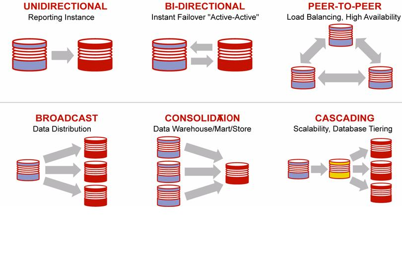
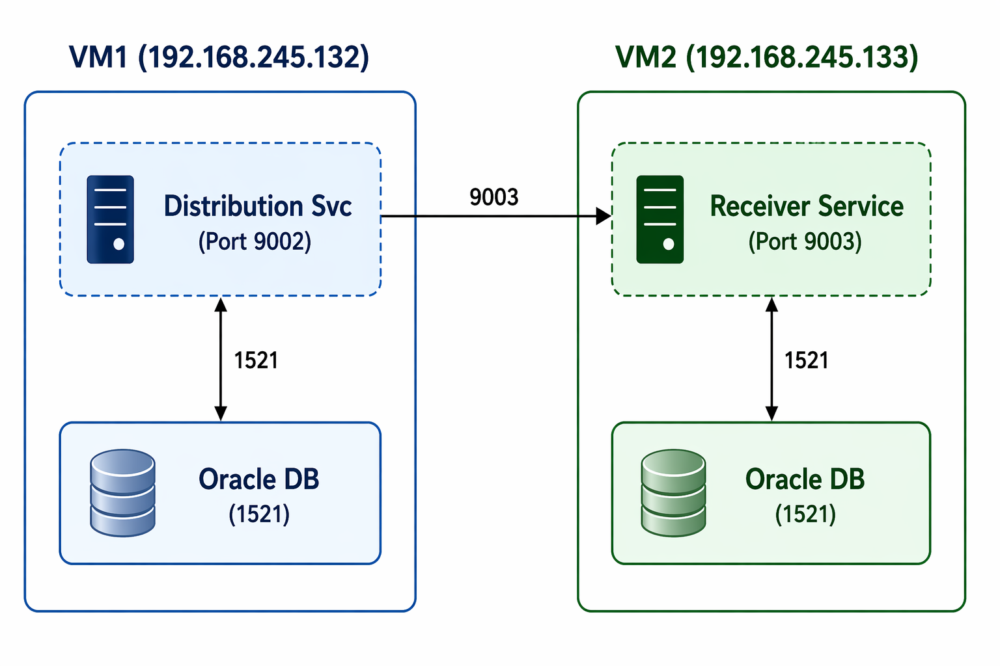

# Topologi Jaringan

## Diagram Topologi

  

---

## Detail Jaringan

### VM1 (Source) — oggsrc

| Interface | IP Address | Subnet | Keterangan |
|---|---|---|---|
| ens33 | 192.168.245.132 | /24 | Network utama (NAT/Bridged) |
| ens34 | 192.168.197.101 | /24 | Network internal (Host-only) |

### VM2 (Target) — oggtgt

| Interface | IP Address | Subnet | Keterangan |
|---|---|---|---|
| ens33 | 192.168.245.133 | /24 | Network utama (NAT/Bridged) |
| ens34 | 192.168.197.102 | /24 | Network internal (Host-only) |

---

## Alur Komunikasi Antar VM

  

---

## Direktori Penting

### VM1 (Source)

| Direktori | Keterangan |
|---|---|
| `/u01/app/ogg` | OGG Software Home |
| `/u01/app/ogg_deployments` | Service Manager Deployment Home |
| `/u01/app/ogg_depot/oggsource` | Deployment oggsource |
| `/u01/app/ogg_depot/oggsource/var/lib/data/dirdat` | Lokasi trail file (et) |
| `/u01/app/oraInventory` | Oracle Inventory |

### VM2 (Target)

| Direktori | Keterangan |
|---|---|
| `/u01/app/ogg` | OGG Software Home |
| `/u01/app/ogg_deployments` | Service Manager Deployment Home |
| `/u01/app/ogg_depot/oggtarget` | Deployment oggtarget |
| `/u01/app/ogg_depot/oggtarget/var/lib/data` | Lokasi trail file (rt) |
| `/u01/app/oraInventory` | Oracle Inventory |
