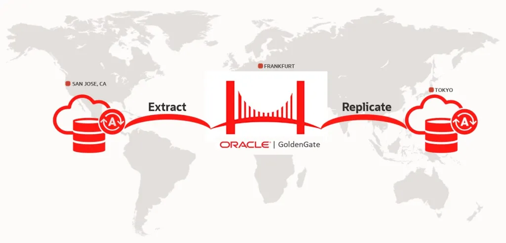
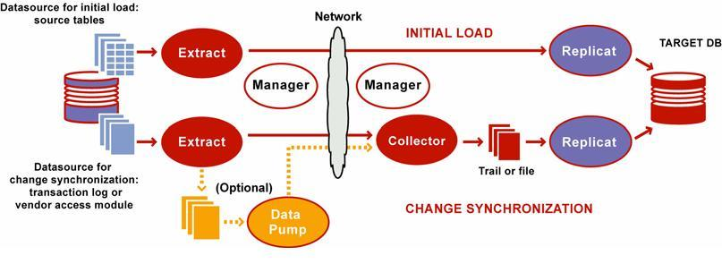

# Oracle GoldenGate 21c

  

## Apa itu Oracle GoldenGate?

**Oracle GoldenGate (OGG)** adalah solusi replikasi data real-time dari Oracle yang memungkinkan transfer data antar database dengan latensi rendah. OGG bekerja dengan membaca **redo log** dari database sumber dan mengaplikasikan perubahan ke database target secara real-time.

OGG 21c menggunakan arsitektur **Microservices** berbasis REST API dengan antarmuka web (Web GUI) untuk manajemen proses replikasi.

---

## Arsitektur Replikasi

  

---

## Komponen Utama

| Komponen | Port | Fungsi |
|---|---|---|
| **Service Manager** | 55000 | Manajemen pusat semua service OGG |
| **Administration Service** | 9001 | Kelola Extract dan Replicat |
| **Distribution Service** | 9002 | Kirim trail file ke target |
| **Receiver Service** | 9003 | Terima trail file dari source |
| **Performance Metrics** | 9004 | Monitor performa replikasi |

---

## Informasi Lingkungan

| Item | VM1 (Source) | VM2 (Target) |
|---|---|---|
| **Hostname** | oggrafi-src | oggrafi-tgt |
| **IP Address** | 192.168.245.132 | 192.168.245.133 |
| **OS** | Oracle Linux 7 | Oracle Linux 7 |
| **Oracle DB** | 19c (ORCL) | 19c (ORCL) |
| **OGG Version** | 21.3.0.0.0 | 21.3.0.0.0 |
| **OGG Home** | /u01/app/ogg | /u01/app/ogg |
| **Deployment** | oggsource | oggtarget |

---

## Akses GUI

=== "VM1 (Source)"

    | Service | URL |
    |---|---|
    | Service Manager | [http://192.168.245.132:55000](http://192.168.245.132:55000) |
    | Administration Service | [http://192.168.245.132:9001](http://192.168.245.132:9001) |
    | Distribution Service | [http://192.168.245.132:9002](http://192.168.245.132:9002) |
    | Receiver Service | [http://192.168.245.132:9003](http://192.168.245.132:9003) |

=== "VM2 (Target)"

    | Service | URL |
    |---|---|
    | Service Manager | [http://192.168.245.133:55000](http://192.168.245.133:55000) |
    | Administration Service | [http://192.168.245.133:9001](http://192.168.245.133:9001) |
    | Distribution Service | [http://192.168.245.133:9002](http://192.168.245.133:9002) |
    | Receiver Service | [http://192.168.245.133:9003](http://192.168.245.133:9003) |

!!! info "Kredensial Login"
    - **Username:** `yourusername`
    - **Password:** `yourpassword`

---

## Mulai dari Sini

- :material-rocket-launch: **[Persiapan & Prasyarat](getting-started/requirements.md)**

    Pelajari kebutuhan sistem sebelum instalasi

- :material-download: **[Instalasi OGG](installation/install-vm1.md)**

    Panduan instalasi OGG di VM1 dan VM2

- :material-cog: **[Konfigurasi Database](configuration/database-source.md)**

    Konfigurasi Oracle Database untuk OGG

- :material-database-sync: **[Setup Replikasi](replication/extract.md)**

    Buat Extract, Distribution, dan Replicat

