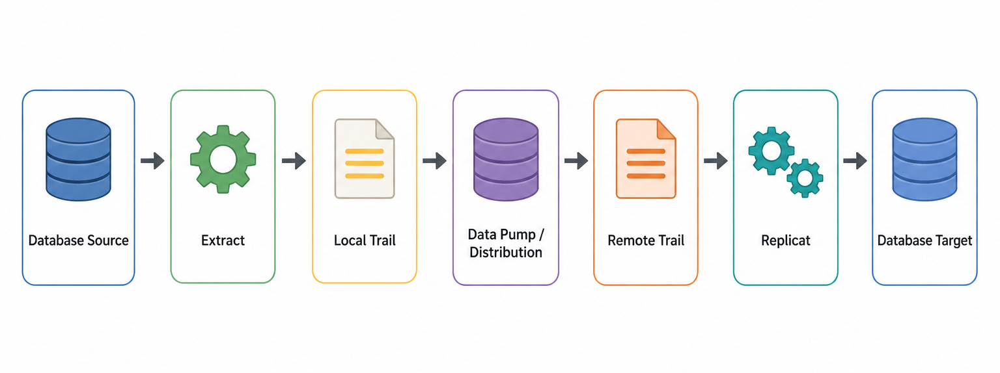

# Pengenalan OGG

Oracle GoldenGate (OGG) adalah platform replikasi data yang digunakan untuk menangkap, memindahkan, dan menerapkan perubahan data antar sistem database dengan latensi rendah.

OGG umum digunakan untuk:

- Replikasi real-time antar database,
- Migrasi database dengan downtime minimal,
- Disaster recovery,
- Integrasi data operasional,
- Distribusi data antar aplikasi atau lokasi.

Pada prinsipnya, OGG membaca perubahan dari database source, menyimpannya ke trail file, lalu mengirim dan menerapkan perubahan tersebut ke database target.

## Alur Dasar

  

