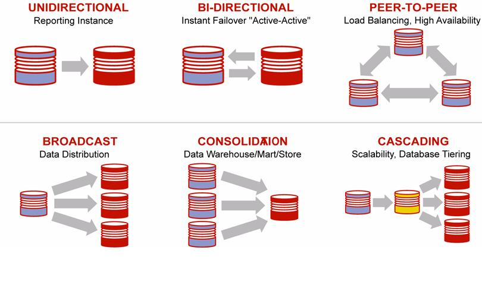

---
icon: fontawesome/solid/network-wired
---

# Topologi

Topologi OGG menggambarkan hubungan antara database source, proses replikasi, jaringan, dan database target.

## Topologi Umum

  

## Pola Replikasi

| Pola | Deskripsi |
|---|---|
| Unidirectional | Replikasi satu arah dari source ke target, umumnya digunakan untuk reporting instance. |
| Bi-Directional | Dua database saling bertukar perubahan untuk mendukung instant failover atau konfigurasi active-active. |
| Peer-to-Peer | Beberapa database saling bertukar perubahan untuk load balancing dan high availability. |
| Broadcast | Satu source mendistribusikan perubahan data ke beberapa target. |
| Consolidation | Beberapa source mengirimkan perubahan data ke satu target, seperti data warehouse, data mart, atau data store. |
| Cascading | Target dari satu replikasi menjadi source untuk replikasi berikutnya, berguna untuk scalability dan database tiering. |
